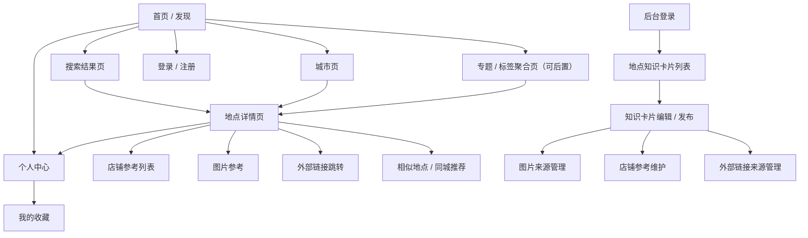
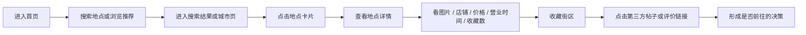

# 一期产品信息架构与页面原型

## 1. 产出目标

本文件将需求文档进一步收敛为一期 MVP 的产品结构，用于指导后续产品设计、视觉设计和开发实现。

本次产出包含：
- 一期信息架构
- 用户主流程
- 页面原型清单
- 页面模块定义
- 低保真原型图说明

## 2. 一期产品结构原则

### 2.1 产品核心
一期产品只解决一个核心问题：

让用户在搜索或浏览一个街区型地点时，能在 1 到 3 分钟内判断这个地方是否值得去、适合怎么逛、消费大概如何，以及还能去哪里看更多真实内容。

### 2.2 结构原则
- 以“地点/街区”为主对象，而不是单店
- 以“决策信息聚合”为主，不做重社区
- 首页负责发现，搜索负责找地点，详情页负责完成决策
- 店铺、图片、外部链接都是为地点服务的附属信息

## 3. 一期信息架构

## 4. 导航结构

### 4.1 用户端一级页面
- 首页 / 发现
- 搜索结果页
- 城市页
- 地点详情页
- 登录 / 注册页
- 个人中心

### 4.2 用户端二级信息模块
- 图片参考
- 店铺参考
- 外部内容链接
- 相似地点推荐
- 收藏入口
- 我的收藏列表

### 4.3 运营后台页面
- 登录页
- 知识卡片列表页
- 知识卡片编辑页

## 5. 用户主流程

## 6. 页面原型清单

### 6.1 首页 / 发现页

#### 页面目标
承接首次访问，帮助用户快速进入搜索或发现城市中的代表性街区。

#### 核心模块
- 顶部品牌区
- 全局搜索框
- 热门城市入口
- 精选街区卡片
- 分类标签入口
- 本周推荐或编辑推荐
- 登录入口
- 个人中心入口

#### 关键动作
- 搜索地点
- 进入城市页
- 进入地点详情
- 点击标签筛选
- 登录
- 进入个人中心

### 6.2 搜索结果页

#### 页面目标
帮助用户根据关键词快速锁定一个合适的街区地点。

#### 核心模块
- 搜索框和搜索词回显
- 筛选条
- 结果列表
- 地图占位区
- 热门相关搜索词
- 地点收藏数

#### 关键动作
- 修改搜索词
- 筛选城市/标签
- 点击地点卡片进入详情
- 直接收藏地点

### 6.3 城市页

#### 页面目标
按城市聚合适合闲逛的地点，建立城市级探索入口。

#### 核心模块
- 城市头图和简介
- 城市标签
- 推荐街区列表
- 分类筛选
- 可串联路线建议

#### 关键动作
- 浏览城市里的地点
- 按标签筛选
- 进入地点详情

### 6.4 地点详情页

#### 页面目标
让用户围绕一个地点完成是否前往的判断。

#### 核心模块
- 首屏信息区
- 图片参考区
- 地点介绍区
- 实用信息区
- 代表店铺区
- 外部链接区
- 同城/相似推荐区
- 收藏按钮
- 全站收藏数

#### 关键动作
- 浏览图片
- 查看营业时间和消费参考
- 看代表店铺
- 跳转第三方内容
- 收藏
- 分享

### 6.5 登录 / 注册页

#### 页面目标
支持用户完成账号注册和登录，以便使用收藏功能。

#### 核心模块
- 登录表单
- 注册表单
- 第三方登录入口（可后续扩展）

### 6.6 个人中心

#### 页面目标
帮助用户管理自己的收藏街区和个人信息。

#### 核心模块
- 用户信息区
- 我的收藏街区列表
- 退出登录
### 6.7 后台地点列表页

#### 页面目标
让运营快速查看地点知识卡片，并维护来源、摘要和推荐内容。

#### 核心模块
- 搜索栏
- 筛选栏
- 地点表格
- 来源平台
- 上线状态
- 最后更新时间

### 6.8 后台地点编辑页

#### 页面目标
编辑地点知识卡片，并维护来源链接、图片来源和推荐摘要。

#### 核心模块
- 基础信息区
- 图片来源管理区
- 店铺参考区
- 外部链接来源区
- 预览区
- 保存和发布区

## 7. 页面优先级建议

### 7.1 一期必须上线的页面
- 首页 / 发现页
- 搜索结果页
- 地点详情页
- 登录 / 注册页
- 个人中心
- 后台知识卡片列表页
- 后台知识卡片编辑页

### 7.2 可以二期补充的页面
- 城市页
- 标签聚合页

## 8. 原型模块定义

## 8.1 首页卡片定义

### 地点卡片字段
- 封面图
- 地点名称
- 城市
- 标签 2 到 4 个
- 一句话描述
- 推荐理由或氛围关键词

### 卡片点击行为
- 点击卡片进入地点详情

## 8.2 地点详情页模块定义

### 首屏 Hero
- 地点名称
- 城市和区域
- 一句话描述
- 标签
- 封面大图
- 推荐游览时长

### 实用信息模块
- 参考营业时间
- 人均消费区间
- 是否免费
- 最佳前往时段
- 交通建议
- 更新时间

### 店铺参考模块
- 店名
- 类型
- 简短推荐语
- 价格参考
- 外部链接

### 外部链接模块
- 平台名称
- 标题
- 链接类型
- 简短备注

## 9. 内容组织建议

### 9.1 地点详情页信息顺序
推荐顺序如下：

1. 先给用户一个整体判断
2. 再给氛围和图片
3. 再给实用信息
4. 再给代表店铺
5. 再给外部链接深挖

原因：
- 用户先想知道值不值得看
- 然后想知道长什么样
- 再决定是否值得去和怎么去

### 9.2 搜索结果页信息密度
搜索结果页应保持高密度但可快速扫读：
- 一屏内尽量展示 6 到 10 个候选地点
- 每个卡片只放最关键的信息
- 不要在结果页堆太多长文案

## 10. 原型图文件

已同步输出以下低保真原型图文件：
- `/Users/denny/Documents/New project/prototype/01-home-discovery.svg`
- `/Users/denny/Documents/New project/prototype/02-search-results.svg`
- `/Users/denny/Documents/New project/prototype/03-place-detail.svg`
- `/Users/denny/Documents/New project/prototype/04-admin-editor.svg`
- `/Users/denny/Documents/New project/prototype/index.html`

## 11. 下一步建议

如果继续推进，最建议优先做下面两件事：

1. 从这套低保真原型继续细化为高保真 UI
2. 按原型字段补一版数据库表结构和接口清单
