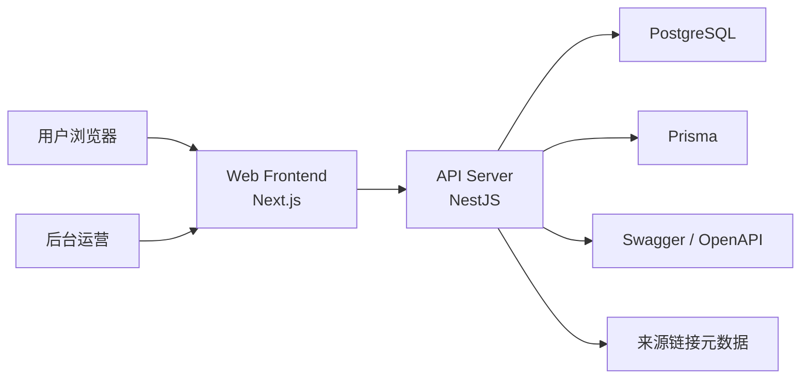
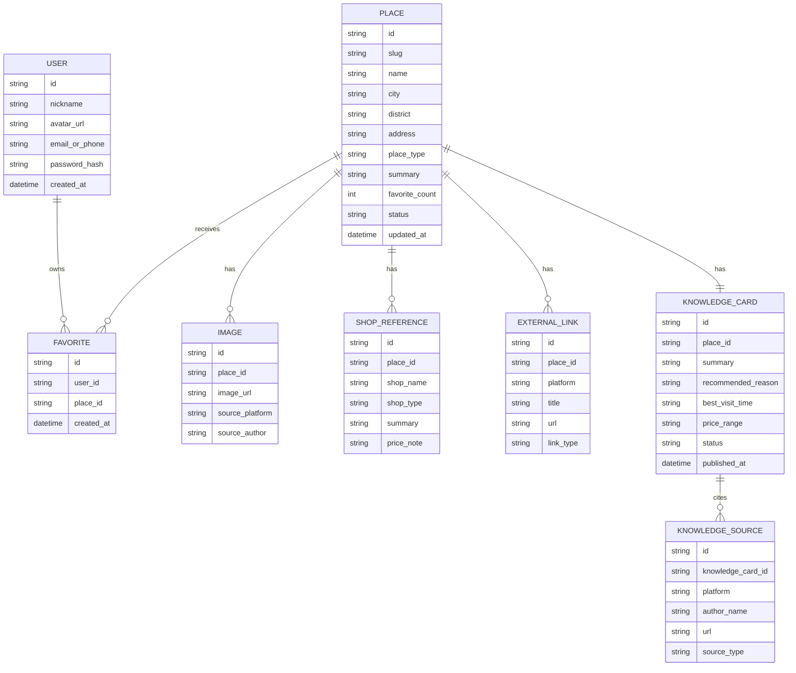
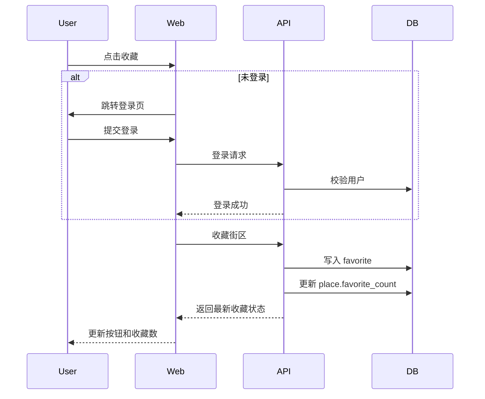
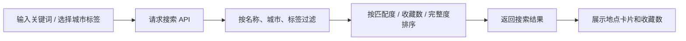
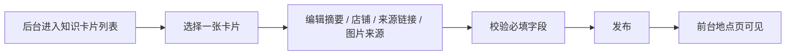

# 创意街区探索工具前后端框架与系统设计

## 1. 文档目标

本文件基于当前的需求文档、信息架构、高保真原型和测试用例，给出一期可直接进入开发的前后端框架方案。

本设计重点解决四件事：
- 明确前端和后端应分别承担什么责任
- 确定一期技术栈与目录结构
- 定义核心模块、数据模型和接口边界
- 保证测试用例中的主流程和“无死胡同”要求可落地

## 2. 一期产品目标回顾

一期不是做泛旅游平台，而是做一个围绕街区的知识汇总和决策工具：
- 用户可以发现、搜索、查看街区
- 用户可以登录、收藏街区、在个人中心查看收藏
- 每个街区展示全站收藏数
- 内容来源于公开网络信息的知识汇总，不做平台内容搬运
- 后台维护的是“知识卡片”和“来源关系”，不是全量点评内容

## 3. 总体技术结论

## 3.1 推荐架构
一期推荐采用“前后端分离但同仓开发”的架构：
- 前端：Next.js
- 后端：NestJS
- 数据库：PostgreSQL
- ORM：Prisma
- 文档：Swagger / OpenAPI

原因：
- 前端需要同时做好内容展示、SEO、登录收藏交互和多页面跳转，Next.js 更适合
- 后端需要稳定管理用户、收藏、街区、知识卡片、来源链接和后台模块，NestJS 的模块化更清晰
- PostgreSQL 足够支撑一期的结构化数据、收藏关系和基础搜索
- Prisma 适合用类型安全方式维护表结构和查询

## 3.2 为什么不建议一期做纯 Next.js 全栈
如果只做 Demo，Next.js 全栈是可行的；但当前功能已经包含：
- 用户账号
- 收藏关系
- 后台知识台
- 来源管理
- 前台和后台两套业务边界

因此一期更适合把 API 层独立出来，避免后续后台和内容管理能力膨胀时前后端纠缠。

## 4. 推荐技术栈

## 4.1 前端
- `Next.js App Router`
- `TypeScript`
- `Tailwind CSS`
- `TanStack Query`

前端职责：
- 页面路由与渲染
- SEO 友好的街区详情页
- 搜索页与个人中心交互
- 登录、收藏、取消收藏等用户操作
- 与后端 API 通信

推荐原则：
- 内容页优先服务端渲染
- 登录后状态和收藏操作优先客户端交互
- 页面跳转、空状态、错误状态必须可恢复

## 4.2 后端
- `NestJS`
- `TypeScript`
- `@nestjs/swagger`
- `Prisma`

后端职责：
- 提供 REST API
- 用户认证与会话
- 收藏关系维护
- 街区与知识卡片管理
- 来源链接和图片来源管理
- 后台发布流程

## 4.3 数据层
- `PostgreSQL`
- `Prisma Migrate`

一期不额外引入 Elasticsearch。
搜索先使用：
- PostgreSQL `ILIKE`
- 标签筛选
- 城市筛选
- 排序字段（收藏数、完整度、更新时间）

## 5. 官方资料依据

以下选择基于官方文档能力判断：
- Next.js 官方文档说明其是用于构建全栈 Web 应用的 React 框架，并支持 App Router、Server Components、Layouts、Navigation 和服务端数据获取。
- NestJS 官方文档说明其适合构建高效、可扩展的 Node.js 服务端应用，天然适合模块化 API 服务。
- NestJS 官方文档提供 OpenAPI / Swagger 集成能力，适合后台管理和前后端协作。
- Prisma 官方文档说明 Prisma 提供类型安全查询、迁移和数据建模能力，适合 Node.js / TypeScript 后端。
- Tailwind 官方文档提供 Next.js 集成方案。
- TanStack Query 官方文档说明其用于获取、缓存、同步和更新 server state，适合收藏、个人中心、列表刷新等用户态数据。

## 6. 系统架构图



## 7. 仓库结构建议

一期建议采用 monorepo：

```text
new-project/
  apps/
    web/                  # Next.js 前端
    api/                  # NestJS 后端
  packages/
    ui/                   # 公共 UI 组件
    config/               # ESLint / TSConfig / 环境配置
    types/                # 前后端共享类型
  docs/
    产品文档
    设计图
    测试用例
```

如果暂时不做 monorepo，也至少建议拆成：

```text
frontend/
backend/
```

## 8. 前端框架设计

## 8.1 路由结构建议

```text
app/
  (marketing)/
    page.tsx                    # 首页 / 发现页
    search/page.tsx             # 搜索结果页
    place/[slug]/page.tsx       # 地点详情页
    login/page.tsx              # 登录 / 注册
    profile/page.tsx            # 个人中心
  admin/
    knowledge/page.tsx          # 知识卡片列表
    knowledge/[id]/page.tsx     # 知识卡片编辑页
  not-found.tsx
  layout.tsx
```

## 8.2 前端页面职责

### 首页
- 展示重点城市
- 展示精选街区
- 展示收藏数
- 提供搜索入口
- 提供登录 / 个人中心入口

### 搜索结果页
- 接收关键词、城市、标签参数
- 请求搜索 API
- 展示结果卡片和收藏数
- 支持直接收藏
- 支持空状态页

### 地点详情页
- SSR 渲染基础内容
- 展示知识卡片内容
- 展示图片来源、店铺参考、来源链接
- 展示全站收藏数
- 处理收藏动作

### 登录 / 注册页
- 登录表单
- 注册表单
- 登录成功后返回原始意图页

### 个人中心
- 用户资料
- 我的收藏
- 空状态处理
- 退出登录

### 后台知识台
- 知识卡片列表
- 编辑知识卡片
- 管理来源链接
- 管理图片来源
- 发布回答卡片

## 8.3 前端组件分层建议

```text
apps/web/src/
  components/
    layout/
    place/
    search/
    profile/
    auth/
    admin/
  features/
    auth/
    favorites/
    places/
    search/
    knowledge/
  lib/
    api/
    utils/
    constants/
```

## 8.4 前端状态管理建议

前端状态分三类：

### A 类：服务端内容状态
- 首页精选街区
- 搜索结果
- 地点详情
- 个人收藏列表

建议：
- 首屏内容优先使用 Next.js 服务端获取
- 用户触发的收藏、取消收藏、个人中心刷新使用 TanStack Query 管理

### B 类：本地 UI 状态
- 筛选面板开关
- 登录表单错误
- 收藏按钮 loading

建议：
- 使用 React 本地 state 即可

### C 类：用户身份状态
- 登录态
- 当前用户信息

建议：
- 使用 HttpOnly Cookie + 前端请求当前会话接口

## 8.5 前端无死胡同要求

所有页面必须满足：
- 顶部始终存在主导航
- 空状态有去发现或去搜索入口
- 未登录收藏必有登录跳转
- 登录后可回到原操作地点
- 404 和无结果页必须有返回首页和重新搜索入口

## 9. 后端框架设计

## 9.1 Nest 模块划分建议

```text
src/
  modules/
    auth/
    users/
    places/
    favorites/
    search/
    knowledge/
    sources/
    admin/
  common/
    guards/
    interceptors/
    filters/
    dto/
    utils/
  prisma/
```

## 9.2 模块职责

### auth
- 注册
- 登录
- 退出
- 当前用户会话

### users
- 用户资料查询
- 个人中心基础信息

### places
- 地点详情
- 首页精选
- 城市入口
- 收藏数字段返回

### favorites
- 收藏街区
- 取消收藏
- 获取我的收藏列表
- 维护街区收藏数

### search
- 关键词搜索
- 城市筛选
- 标签筛选
- 无结果处理

### knowledge
- 知识卡片 CRUD
- 发布状态
- 地点摘要维护

### sources
- 来源链接管理
- 图片来源管理
- 来源校验

### admin
- 后台聚合接口
- 列表筛选
- 发布流程

## 9.3 接口风格建议

一期统一使用 REST：
- 前台简单直接
- 后台更适合表单和管理接口
- Swagger 易于协作

不建议一期引入 GraphQL。

## 10. 核心 API 设计

## 10.1 认证

### `POST /api/v1/auth/register`
请求：
- nickname
- email_or_phone
- password

响应：
- user
- access status

### `POST /api/v1/auth/login`
请求：
- email_or_phone
- password

响应：
- user
- session / cookie

### `POST /api/v1/auth/logout`
响应：
- success

### `GET /api/v1/auth/me`
响应：
- 当前用户信息

## 10.2 前台地点

### `GET /api/v1/home`
返回：
- 精选街区
- 重点城市
- 推荐标签

### `GET /api/v1/places`
查询参数：
- q
- city
- tags
- sort
- page

返回：
- 列表
- 总数
- 分页信息

### `GET /api/v1/places/:slug`
返回：
- 基础信息
- 收藏数
- 图片
- 店铺参考
- 来源链接
- 实用信息
- 决策提示

## 10.3 收藏

### `POST /api/v1/favorites/:placeId`
说明：
- 收藏街区

### `DELETE /api/v1/favorites/:placeId`
说明：
- 取消收藏街区

### `GET /api/v1/me/favorites`
返回：
- 我的收藏列表

## 10.4 后台知识台

### `GET /api/v1/admin/knowledge`
返回：
- 知识卡片列表

### `GET /api/v1/admin/knowledge/:id`
返回：
- 知识卡片详情
- 来源链接
- 图片来源
- 店铺参考

### `PATCH /api/v1/admin/knowledge/:id`
说明：
- 更新知识卡片

### `POST /api/v1/admin/knowledge/:id/publish`
说明：
- 发布知识卡片

## 11. 数据模型设计



## 12. 关键流程设计

## 12.1 登录与收藏流程



## 12.2 搜索流程



## 12.3 知识卡片发布流程



## 13. 前后端边界

## 13.1 前端负责
- 路由、布局、页面渲染
- 表单交互
- 收藏按钮即时反馈
- 空状态、错误状态、回退路径

## 13.2 后端负责
- 数据权限
- 用户身份认证
- 收藏写入与计数
- 来源和知识卡片管理
- 返回统一结构的 API 响应

## 14. 接口返回规范建议

统一返回结构：

```json
{
  "code": 0,
  "message": "ok",
  "data": {}
}
```

错误结构：

```json
{
  "code": 4001,
  "message": "login required",
  "data": null
}
```

## 15. 安全与权限

## 15.1 用户端
- 登录接口做频率限制
- 密码哈希存储
- 收藏接口需要登录
- Cookie 使用 HttpOnly

## 15.2 后台
- 后台接口必须鉴权
- 发布操作记录操作者和时间
- 图片来源和作者名称为必填校验项

## 16. 对测试用例的映射

本架构直接支撑以下测试重点：
- 登录 / 注册
- 收藏 / 取消收藏
- 收藏数跨页面同步
- 空收藏页
- 搜索无结果
- 来源展示规范
- 发布失败可恢复
- 页面无死胡同

## 17. 实施顺序建议

### Phase 1
- PostgreSQL + Prisma schema
- NestJS 基础模块
- Next.js 页面骨架

### Phase 2
- 登录 / 注册 / 当前用户
- 收藏接口与个人中心
- 首页 / 搜索 / 详情 API

### Phase 3
- 知识卡片后台
- 来源链接管理
- 图片来源管理

### Phase 4
- 收藏数同步优化
- SEO 与性能优化
- 测试用例回归

## 18. 最终建议

如果现在进入开发，一期最稳的技术组合是：
- Web：Next.js App Router + TypeScript + Tailwind CSS + TanStack Query
- API：NestJS + Swagger + Prisma
- DB：PostgreSQL

这套组合对当前的内容展示、登录收藏、后台知识台和后续扩展都足够稳，不会把一期做成难以维护的拼装项目。

## 19. 参考资料

- [Next.js Docs](https://nextjs.org/docs)
- [Next.js App Router](https://nextjs.org/docs/app)
- [Next.js Fetching Data](https://nextjs.org/docs/app/getting-started/fetching-data)
- [NestJS Docs](https://docs.nestjs.com/)
- [NestJS First Steps](https://docs.nestjs.com/first-steps)
- [NestJS OpenAPI](https://docs.nestjs.com/openapi/introduction)
- [Prisma ORM Overview](https://www.prisma.io/docs/orm)
- [Prisma Getting Started](https://www.prisma.io/docs/v6/orm/getting-started)
- [Prisma Supported Databases](https://www.prisma.io/docs/orm/overview/databases/sqlite)
- [Tailwind CSS Next.js Guide](https://tailwindcss.com/docs/guides/nextjs)
- [TanStack Query Overview](https://tanstack.com/query/latest/docs/framework/react/overview)
